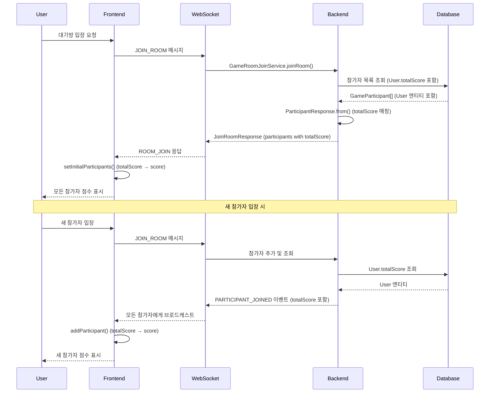

# Design Document

## Overview

이 설계는 퀴즈 대기방에서 모든 참가자의 점수를 DB와 동기화하여 표시하는 기능을 구현합니다. 현재 `useWaitingRoom` 훅에서 모든 참가자 점수가 하드코딩된 `0`으로 설정되어 있는 문제를 해결합니다.

핵심 아이디어는 다음과 같습니다:
1. 백엔드의 `ParticipantResponse` DTO에 `totalScore` 필드 추가
2. 대기방 입장 시 모든 참가자의 점수를 DB에서 조회하여 응답에 포함
3. WebSocket 이벤트(새 참가자 입장)에도 점수 정보 포함
4. 프론트엔드에서 받은 점수를 `participant.score`에 매핑하여 UI에 표시

## Architecture

### Component Hierarchy

```
QuizWaitingRoom (페이지)
├── useAuthStore (전역 상태)
│   └── user.totalScore (DB 동기화된 점수)
├── useWaitingRoom (로컬 상태)
│   └── participants[] (점수 포함)
└── WaitingRoomParticipantsGrid
    └── WaitingRoomParticipantCard
        └── participant.score 표시
```

### Data Flow



## Components and Interfaces

### 1. ParticipantResponse DTO 수정 (백엔드)

**파일:** `backend/src/main/java/app/signbell/backend/dto/response/ParticipantResponse.java`

**변경 사항:**
- `totalScore` 필드 추가
- `from()` 메서드에서 `User.getTotalScore()` 매핑

**수정된 코드:**
```java
@Getter
@Builder
public class ParticipantResponse {
    private Long userId;
    private String nickname;
    private String profileImageUrl;
    private boolean isHost;
    private boolean isReady;
    private Long totalScore; // 🔑 추가

    public static ParticipantResponse from(GameParticipant participant) {
        return ParticipantResponse.builder()
                .userId(participant.getParticipant().getId())
                .nickname(participant.getParticipant().getNickname())
                .profileImageUrl(participant.getParticipant().getProfileImageUrl())
                .isHost(participant.isHost())
                .isReady(participant.isReady())
                .totalScore(participant.getParticipant().getTotalScore() != null 
                    ? participant.getParticipant().getTotalScore() 
                    : 0L) // 🔑 추가 (null 체크)
                .build();
    }
}
```

### 2. useWaitingRoom 훅 수정 (프론트엔드)

**파일:** `frontend/src/hooks/useWaitingRoom.js`

**변경 사항:**
- `setInitialParticipants` 함수에서 `p.totalScore` 사용
- `addParticipant` 함수에서 `participant.totalScore` 사용

**수정된 함수:**
```javascript
const setInitialParticipants = useCallback((participantsList, myUserId, isWebcamOn) => {
  const formattedParticipants = participantsList.map(p => ({
    id: p.userId,
    userId: p.userId,
    nickname: p.nickname,
    profileImageUrl: p.profileImageUrl,
    score: p.totalScore ?? 0, // 🔑 백엔드에서 받은 totalScore 사용
    isMe: p.userId === myUserId,
    isHost: p.host,
    isReady: p.ready,
    webcamStatus: p.userId === myUserId ? (isWebcamOn ? 'on' : 'off') : 'off'
  }));
  setParticipants(formattedParticipants);
}, []);

const addParticipant = useCallback((participant, myUserId, isWebcamOn) => {
  setParticipants(prev => {
    if (prev.some(p => p.userId === participant.userId)) {
      return prev;
    }
    return [
      ...prev,
      {
        id: participant.userId,
        userId: participant.userId,
        nickname: participant.nickname,
        profileImageUrl: participant.profileImageUrl,
        score: participant.totalScore ?? 0, // 🔑 백엔드에서 받은 totalScore 사용
        isMe: participant.userId === myUserId,
        isHost: participant.host,
        isReady: participant.ready,
        webcamStatus: participant.userId === myUserId ? (isWebcamOn ? 'on' : 'off') : 'off'
      }
    ];
  });
}, []);
```

### 3. QuizWaitingRoom 컴포넌트 수정 (프론트엔드)

**파일:** `frontend/src/pages/quiz/QuizWaitingRoom.jsx`

**변경 사항:**
- `setInitialParticipants` 호출 시 `user.totalScore` 파라미터 제거 (더 이상 필요 없음)
- `addParticipant` 호출 시 `user.totalScore` 파라미터 제거

**수정된 코드:**
```javascript
// handleRoomJoin에서
setInitialParticipants(roomData.participants, myUserId, isWebcamOn);
// 기존: setInitialParticipants(roomData.participants, myUserId, isWebcamOn, user?.totalScore);

// handleParticipantEvent에서
addParticipant(newUser, myUserId, isWebcamOn);
// 기존: addParticipant(newUser, myUserId, isWebcamOn, user?.totalScore);
```

### 4. GameRoomJoinService 확인 (백엔드)

**파일:** `backend/src/main/java/app/signbell/backend/service/GameRoomJoinService.java`

**현재 상태:**
- `ParticipantResponse.from(GameParticipant)` 호출로 자동으로 totalScore 포함
- `GameParticipant`가 `User` 엔티티를 참조하므로 `User.getTotalScore()` 접근 가능

**N+1 문제 해결 확인:**
- `GameParticipantRepository.findByGameRoom_Id()`에 이미 `JOIN FETCH gp.participant` 적용됨
- 참가자 목록 조회 시 User 엔티티가 함께 로딩되어 추가 쿼리 발생하지 않음
- `ParticipantResponse.from()`에서 `participant.getParticipant().getTotalScore()` 호출 시 쿼리 없음

**쿼리 실행 예시:**
```sql
-- 단 1번의 쿼리로 모든 참가자와 User 정보 조회
SELECT gp.*, u.* 
FROM game_participant gp 
JOIN user u ON gp.participant_id = u.user_id 
WHERE gp.game_room_id = ?
```

**변경 불필요:** 서비스 로직은 현재 상태 그대로 사용 (DTO 수정만으로 자동 반영)

## Data Models

### Participant 객체 (useWaitingRoom)

```typescript
interface Participant {
  id: number;              // userId와 동일
  userId: number;          // 사용자 ID
  nickname: string;        // 닉네임
  profileImageUrl: string; // 프로필 이미지 URL
  score: number;           // 🔑 점수 (authStore.user.totalScore에서 가져옴)
  isMe: boolean;           // 본인 여부
  isHost: boolean;         // 방장 여부
  isReady: boolean;        // 준비 상태
  webcamStatus: 'on' | 'off' | 'denied'; // 웹캠 상태
}
```

### ParticipantResponse (백엔드)

```java
@Getter
@Builder
public class ParticipantResponse {
    private Long userId;
    private String nickname;
    private String profileImageUrl;
    private boolean isHost;
    private boolean isReady;
    private Long totalScore;  // 🔑 추가된 필드
}
```

### WebSocket 메시지 구조

**ROOM_JOIN 응답:**
```json
{
  "success": true,
  "data": {
    "gameRoomId": 123,
    "gameTitle": "퀴즈방",
    "participants": [
      {
        "userId": 1,
        "nickname": "사용자1",
        "profileImageUrl": "https://...",
        "host": true,
        "ready": false,
        "totalScore": 1500  // 🔑 점수 포함
      },
      {
        "userId": 2,
        "nickname": "사용자2",
        "profileImageUrl": "https://...",
        "host": false,
        "ready": true,
        "totalScore": 2300  // 🔑 점수 포함
      }
    ]
  }
}
```

**PARTICIPANT_JOINED 이벤트:**
```json
{
  "success": true,
  "data": {
    "eventType": "PARTICIPANT_JOINED",
    "participant": {
      "userId": 3,
      "nickname": "사용자3",
      "profileImageUrl": "https://...",
      "host": false,
      "ready": false,
      "totalScore": 800  // 🔑 점수 포함
    }
  }
}
```

## Error Handling

### 1. 백엔드에서 totalScore가 null인 경우

**시나리오:** User 엔티티의 totalScore가 null인 경우

**처리 방법:**
- `ParticipantResponse.from()` 메서드에서 null 체크
- null이면 0L로 기본값 설정
- 로그 남기지 않음 (정상적인 초기 상태)

```java
.totalScore(participant.getParticipant().getTotalScore() != null 
    ? participant.getParticipant().getTotalScore() 
    : 0L)
```

### 2. 프론트엔드에서 totalScore 필드가 누락된 경우

**시나리오:** 백엔드 응답에 totalScore 필드가 없는 경우

**처리 방법:**
- Nullish coalescing 연산자(`??`)로 기본값 0 사용
- 에러를 발생시키지 않고 조용히 처리

```javascript
score: p.totalScore ?? 0
```

### 3. User 엔티티 조회 실패

**시나리오:** GameParticipant에서 User를 조회할 수 없는 경우

**처리 방법:**
- JPA 관계 설정으로 자동 조회 (Lazy/Eager Loading)
- 조회 실패 시 `BusinessException` 발생
- 클라이언트에 적절한 에러 메시지 반환

### 4. WebSocket 메시지 전송 실패

**시나리오:** PARTICIPANT_JOINED 이벤트 전송 중 오류 발생

**처리 방법:**
- 백엔드에서 로그 남기고 계속 진행
- 다른 참가자들은 새로고침 시 최신 참가자 목록 확인 가능
- 대기방 기능은 정상 작동

## Testing Strategy

### 1. 단위 테스트 (선택적)

**테스트 대상:**
- `useWaitingRoom` 훅의 `setInitialParticipants` 함수
- `useWaitingRoom` 훅의 `addParticipant` 함수

**테스트 케이스:**
- 내 점수가 올바르게 설정되는지 확인
- 다른 참가자의 점수가 0으로 설정되는지 확인
- totalScore가 undefined일 때 0으로 fallback 되는지 확인

### 2. 통합 테스트 (선택적)

**테스트 시나리오:**
- 대기방 입장 시 `refreshMeSilent` 호출 확인
- authStore의 totalScore 변경 시 UI 업데이트 확인
- API 실패 시 기존 점수 유지 확인

### 3. 수동 테스트 (필수)

**테스트 시나리오:**
1. 게임 완료 후 점수 획득
2. 새로운 대기방 생성 또는 입장
3. 대기방에서 업데이트된 점수 확인
4. 네트워크를 끊고 대기방 입장 시 캐시된 점수 표시 확인
5. 다른 참가자의 점수는 0으로 표시되는지 확인

## Performance Considerations

### 1. 데이터베이스 조회 최적화

- `GameParticipant`와 `User`의 관계가 이미 설정되어 있어 추가 쿼리 불필요
- JPA의 Lazy/Eager Loading 전략에 따라 자동 최적화
- N+1 문제 발생 시 `@EntityGraph` 또는 `fetch join` 고려 (향후 최적화)

### 2. WebSocket 메시지 크기

- totalScore 필드 추가로 메시지 크기가 약간 증가 (8 bytes per participant)
- 최대 4명 참가자이므로 영향 미미 (32 bytes 증가)
- 네트워크 대역폭에 무시할 수 있는 수준

### 3. 프론트엔드 렌더링

- 점수 변경 시 해당 참가자 카드만 리렌더링
- React의 key prop으로 불필요한 리렌더링 방지
- `useCallback`으로 함수 메모이제이션 유지

## Security Considerations

### 1. 인증 확인

- `refreshMeSilent` 호출 전 `isAuthenticated` 확인
- `myUserId`가 존재하는지 확인
- HTTP-Only 쿠키 기반 인증으로 XSS 공격 방지

### 2. 데이터 검증

- 백엔드에서 사용자 ID 검증 (Spring Security의 `@AuthenticationPrincipal`)
- 다른 사용자의 점수는 조회하지 않음 (본인 점수만 표시)

### 3. 에러 정보 노출 방지

- 에러 발생 시 사용자에게 상세 정보를 표시하지 않음
- 콘솔 로그는 개발 환경에서만 활성화 권장

## Implementation Notes

### 1. 백엔드 변경 사항

- `ParticipantResponse` DTO에 `totalScore` 필드만 추가하면 됨
- 서비스 로직 변경 불필요 (DTO의 `from()` 메서드가 자동으로 매핑)
- WebSocket 메시지도 자동으로 totalScore 포함 (동일한 DTO 사용)

### 2. 프론트엔드 변경 사항

- `useWaitingRoom` 훅의 두 함수만 수정
- `QuizWaitingRoom` 컴포넌트에서 파라미터 제거
- 기존 로직 대부분 유지 (최소한의 변경)

### 3. 데이터 일관성

- 대기방 입장 시 항상 DB의 최신 점수 조회
- 게임 완료 후 User.totalScore가 업데이트되면 다음 입장 시 자동 반영
- WebSocket 이벤트로 실시간 동기화

### 4. 게임 완료 후 대기방 복귀 시나리오

**플로우:**
1. 게임 종료 시 `QuizService.endGame()`에서 `user.updateTotalScore(roundScore)` 호출
2. User 엔티티의 totalScore가 DB에 업데이트됨 (Dirty Checking)
3. 게임 종료 메시지 전송 후 방 상태가 WAITING으로 변경
4. 사용자가 "방으로 돌아가기" 버튼 클릭
5. `QuizService.returnToWaitingRoom()` 호출 (또는 재입장)
6. `GameRoomJoinService.joinRoom()` 호출 (이미 참가 중이므로 재입장 처리)
7. DB에서 최신 User.totalScore 조회
8. `ParticipantResponse.from()`에서 totalScore 매핑
9. 프론트엔드에서 업데이트된 점수 표시

**핵심:**
- 게임 종료 시 이미 DB에 점수가 업데이트되어 있음
- 대기방 재입장 시 자동으로 최신 점수 조회
- 추가 API 호출 불필요

### 5. 테스트 시나리오

- 신규 사용자 (totalScore = 0) 입장
- 게임 완료 후 점수 획득한 사용자 입장
- 게임 완료 후 대기방 복귀 (같은 방)
- 게임 완료 후 다른 방 입장
- 여러 참가자가 서로 다른 점수를 가진 경우
- totalScore가 null인 사용자 (DB 마이그레이션 등)

### 6. 향후 확장 가능성

- 게임 중 실시간 점수 업데이트 (SCORE_UPDATED 이벤트)
- 리더보드 기능 추가
- 점수 변경 애니메이션
- 게임 완료 후 대기방 복귀 시 점수 증가 애니메이션 표시
