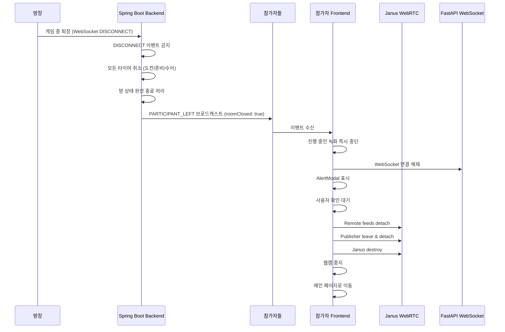

# Design Document

## Overview

이 설계는 퀴즈 게임 중 방장이 퇴장할 때 모든 참가자에게 명확한 알림을 제공하고, 게임 리소스를 안전하게 정리한 후 메인 페이지로 이동시키는 기능을 구현합니다. 기존의 Toast 알림 대신 AlertModal을 사용하여 더 명확한 사용자 경험을 제공하며, 백엔드의 타이머 및 방 상태 관리를 개선하여 빈 대기방이 남지 않도록 합니다.

## Architecture

### 시스템 흐름도



### 컴포넌트 구조

```
QuizGamePage (메인 컴포넌트)
├── AlertModal (방장 퇴장 알림)
├── handleParticipantLeft (이벤트 핸들러)
├── handleHostExit (방장 퇴장 전용 핸들러)
└── cleanupResourcesAndExit (리소스 정리 함수)
```

## Components and Interfaces

### 1. Frontend - QuizGamePage 컴포넌트 수정

#### 1.1 새로운 State 추가

```javascript
// 방장 퇴장 알림 모달 상태
const [showHostExitModal, setShowHostExitModal] = useState(false);
```

#### 1.2 handleParticipantLeft 핸들러 수정

기존 핸들러를 수정하여 `roomClosed` 플래그를 확인하고 방장 퇴장 처리를 분리합니다.

```javascript
const handleParticipantLeft = useCallback((data) => {
  console.log('📥 참가자 퇴장 이벤트 수신:', JSON.stringify(data, null, 2));

  if (data.success && data.data) {
    const eventData = data.data;

    if (eventData.eventType === 'PARTICIPANT_LEFT') {
      const leftUserId = eventData.participant?.userId;
      const leftNickname = eventData.participant?.nickname;
      const isRoomClosed = eventData.roomClosed;

      // 🔥 방장 퇴장으로 인한 방 종료 처리
      if (isRoomClosed) {
        console.log('🚪 방장 퇴장으로 인한 게임 종료');
        handleHostExit();
        return; // 더 이상 진행하지 않음
      }

      // 일반 참가자 퇴장 처리 (기존 로직)
      // ...
    }
  }
}, [gameState, /* ... */]);
```

#### 1.3 handleHostExit 함수 추가

방장 퇴장 시 즉시 실행되는 핸들러입니다.

```javascript
const handleHostExit = useCallback(() => {
  console.log('🚨 방장 퇴장 처리 시작');

  // 1. 진행 중인 녹화 즉시 중단
  if (isRecordingRef.current) {
    isRecordingRef.current = false;
    if (recordingRef.current) {
      cancelAnimationFrame(recordingRef.current);
      recordingRef.current = null;
    }
    console.log('✅ 녹화 중단 완료');
  }

  // 2. FastAPI WebSocket 연결 즉시 해제
  try {
    quizFastApi.disconnect();
    fastApiConnectedRef.current = false;
    metaSentRef.current = false;
    console.log('✅ FastAPI 연결 해제 완료');
  } catch (error) {
    console.error('❌ FastAPI 연결 해제 실패:', error);
  }

  // 3. 대기 상태 초기화
  gameState.setIsWaitingResult(false);

  // 4. AlertModal 표시 (Toast 대신)
  setShowHostExitModal(true);
}, [gameState]);
```

#### 1.4 cleanupResourcesAndExit 함수 추가

AlertModal에서 확인 버튼 클릭 시 실행되는 리소스 정리 함수입니다.

```javascript
const cleanupResourcesAndExit = useCallback(async () => {
  console.log('🧹 리소스 정리 및 메인 이동 시작');

  try {
    // 1. Remote feeds 정리
    if (remoteFeedsRef.current && Object.keys(remoteFeedsRef.current).length > 0) {
      console.log('🔌 Remote feeds 정리 중...');
      Object.values(remoteFeedsRef.current).forEach(feed => {
        try {
          if (feed && typeof feed.detach === 'function') {
            feed.detach();
          }
        } catch (error) {
          console.error('❌ Remote feed detach 실패:', error);
        }
      });
      remoteFeedsRef.current = {};
    }

    // 2. Publisher (내 플러그인) 정리
    if (pluginHandleRef.current) {
      console.log('🔌 Publisher plugin 정리 중...');
      try {
        await new Promise((resolve) => {
          const leave = { request: 'leave' };
          pluginHandleRef.current.send({
            message: leave,
            success: () => {
              console.log('✅ Janus 방 떠나기 성공');
              resolve();
            },
            error: (error) => {
              console.error('❌ Janus 방 떠나기 실패:', error);
              resolve();
            }
          });
          setTimeout(resolve, 500);
        });

        pluginHandleRef.current.detach();
        pluginHandleRef.current = null;
      } catch (error) {
        console.error('❌ Publisher 정리 실패:', error);
        pluginHandleRef.current = null;
      }
    }

    // 3. Janus 연결 종료
    if (janusRef.current) {
      console.log('🔌 Janus 연결 종료 중...');
      try {
        janusRef.current.destroy();
      } catch (error) {
        console.error('❌ Janus destroy 실패:', error);
      }
      janusRef.current = null;
    }

    // 4. 상태 초기화
    setRemoteStreams({});
    setIsJanusConnected(false);
    if (userIdToFeedIdRef.current) {
      userIdToFeedIdRef.current = {};
    }

    // 5. 웹캠 중지
    if (isWebcamOn && stopWebcam) {
      try {
        stopWebcam();
        console.log('✅ 웹캠 정리 완료');
      } catch (error) {
        console.error('❌ 웹캠 정리 실패:', error);
      }
    }

    // 6. WebSocket 연결 해제
    try {
      websocketService.disconnect();
      console.log('✅ WebSocket 연결 해제 완료');
    } catch (error) {
      console.error('❌ WebSocket 해제 실패:', error);
    }

    console.log('✅ 리소스 정리 완료');
  } catch (error) {
    console.error('❌ 리소스 정리 중 오류:', error);
  } finally {
    // 오류 발생 여부와 관계없이 메인으로 이동
    console.log('🏠 메인 페이지로 이동');
    navigate('/main');
  }
}, [
  remoteFeedsRef,
  pluginHandleRef,
  janusRef,
  setRemoteStreams,
  setIsJanusConnected,
  userIdToFeedIdRef,
  isWebcamOn,
  stopWebcam,
  navigate
]);
```

#### 1.5 AlertModal 렌더링 추가

```jsx
<AlertModal
  isOpen={showHostExitModal}
  onClose={cleanupResourcesAndExit}
  title="게임 종료"
  message="방장이 나가서 게임이 종료되었습니다"
  type="warning"
/>
```

### 2. Backend - 타이머 및 방 상태 관리 개선

#### 2.1 타이머 취소 로직

방장 퇴장 시 QuizTimerManager를 통해 모든 활성 타이머를 즉시 취소합니다.

**위치:** `GameRoomLeaveService.java`의 `handleHostLeave` 메서드

**현재 구조:**
- QuizTimerManager가 모든 타이머를 중앙 관리합니다
- `cleanupRoom(roomId)` 메서드가 해당 방의 모든 타이머를 자동으로 취소합니다
- 타이머 키 형식: "roomId:questionNumber:timerType" (예: "123:1:PREPARE")

**구현 방법:**

```java
private ParticipantEventResponse handleHostLeave(GameRoom room, ParticipantResponse hostResponse) {
    Long roomId = room.getId();
    log.info("방장 퇴장 감지 - 방 종료 처리 시작. roomId: {}", roomId);

    // 🆕 1. 모든 타이머 즉시 취소
    try {
        timerManager.cleanupRoom(roomId);
        log.info("✅ 타이머 정리 완료 - roomId: {}", roomId);
    } catch (Exception e) {
        log.error("❌ 타이머 정리 실패 - roomId: {}", roomId, e);
        // 타이머 정리 실패해도 방 종료는 계속 진행
    }

    // 2. 방장 제외한 다른 참가자들의 userId 목록 조회
    List<Long> otherParticipantUserIds = participantRepository
        .findByGameRoom_Id(roomId)
        .stream()
        .filter(p -> !p.isHost())
        .map(p -> p.getParticipant().getId())
        .toList();

    // ... 기존 로직 계속
}
```

#### 2.2 방 완전 종료 로직

방장 퇴장 시 방이 WAITING 상태로 돌아가지 않고 완전히 종료됩니다.

**현재 구조:**
- `GameRoomLeaveService.handleHostLeave` 메서드가 이미 방 종료 로직을 구현하고 있습니다
- `room.closeRoom()` 메서드가 방 상태를 변경합니다
- `participantRepository.deleteAllByGameRoom(room)`으로 모든 참가자를 삭제합니다
- `sessionService.cleanupMultipleSessions`로 WebSocket 세션을 정리합니다

**검증 및 개선 사항:**

1. **GameRoom.closeRoom() 메서드 확인**
   - 방 상태를 FINISHED 또는 적절한 종료 상태로 변경하는지 확인
   - 참가자 수를 0으로 초기화하는지 확인

2. **QuizStateCache 정리 확인**
   - `quizStateCache.clearRoomState(roomId)` 호출 여부 확인
   - 게임 진행 중 캐시 데이터 정리 확인

3. **방 목록에서 제거**
   - 방이 FINISHED 상태이면 방 목록 API에서 자동으로 제외되는지 확인
   - 필요시 방 삭제 로직 추가

#### 2.3 PARTICIPANT_LEFT 이벤트 수정

`roomClosed` 플래그를 추가하여 방장 퇴장임을 명시합니다.

**현재 구조:**
- `ParticipantEventResponse` DTO에 이미 `roomClosed` 필드가 존재합니다
- `handleHostLeave`는 `roomClosed=true`로 설정된 이벤트를 반환합니다
- `handleParticipantLeave`는 `roomClosed=false`로 설정된 이벤트를 반환합니다

**검증 사항:**

```java
// handleHostLeave 메서드의 반환값 확인
return ParticipantEventResponse.builder()
    .eventType("ROOM_CLOSED")  // 🔍 이벤트 타입 확인
    .participant(hostResponse)
    .currentParticipants(0)
    .gameRoomId(roomId)
    .roomClosed(true)  // ✅ 이미 구현됨
    .build();

// handleParticipantLeave 메서드의 반환값 확인
return ParticipantEventResponse.builder()
    .eventType("PARTICIPANT_LEFT")
    .participant(participantResponse)
    .currentParticipants(room.getCurrentParticipants())
    .gameRoomId(room.getId())
    .roomClosed(false)  // ✅ 이미 구현됨
    .nextChallengerId(nextChallengerId)
    .build();
```

**주의사항:**
- 방장 퇴장 시 `eventType`이 "ROOM_CLOSED"인지 "PARTICIPANT_LEFT"인지 확인 필요
- Frontend에서는 `roomClosed` 플래그로 판단하므로 `eventType`은 중요하지 않을 수 있음
- 일관성을 위해 `eventType`을 "PARTICIPANT_LEFT"로 통일하고 `roomClosed`로 구분하는 것을 권장

## Data Models

### Frontend Data Models

#### AlertModal Props

```typescript
interface AlertModalProps {
  isOpen: boolean;           // 모달 열림 상태
  onClose: () => void;       // 모달 닫기 핸들러 (확인 버튼 & 오버레이 클릭)
  title: string;             // 모달 제목 (예: "게임 종료")
  message: string;           // 알림 메시지 (예: "방장이 나가서 게임이 종료되었습니다")
  type: 'info' | 'warning' | 'error' | 'success'; // 알림 타입
}
```

#### ParticipantLeftEvent (WebSocket)

```typescript
interface ParticipantLeftEvent {
  success: boolean;
  data: {
    eventType: 'PARTICIPANT_LEFT';
    participant: {
      userId: number;
      nickname: string;
    };
    roomClosed: boolean;      // 🆕 방장 퇴장으로 인한 방 종료 여부
    nextChallengerId?: number;
  };
}
```

### Backend Data Models

#### ParticipantLeftEvent (Java)

```java
@Data
@Builder
public class ParticipantLeftEvent {
    private String eventType;           // "PARTICIPANT_LEFT"
    private ParticipantInfo participant;
    private Boolean roomClosed;         // 🆕 방장 퇴장으로 인한 방 종료 여부
    private Long nextChallengerId;
}

@Data
@Builder
public class ParticipantInfo {
    private Long userId;
    private String nickname;
}
```

## Error Handling

### Frontend Error Handling

#### 1. 리소스 정리 중 오류

각 리소스 정리 단계를 try-catch로 감싸서 한 단계에서 오류가 발생해도 다음 단계가 계속 진행되도록 합니다.

```javascript
try {
  // Remote feeds 정리
} catch (error) {
  console.error('❌ Remote feed 정리 실패:', error);
  // 계속 진행
}

try {
  // Publisher 정리
} catch (error) {
  console.error('❌ Publisher 정리 실패:', error);
  // 계속 진행
}

// ... 나머지 리소스 정리
```

#### 2. 메인 페이지 이동 보장

finally 블록을 사용하여 오류 발생 여부와 관계없이 메인 페이지로 이동합니다.

```javascript
try {
  // 리소스 정리
} catch (error) {
  console.error('❌ 리소스 정리 중 오류:', error);
} finally {
  navigate('/main'); // 반드시 실행
}
```

#### 3. FastAPI 연결 해제 오류

FastAPI 연결 해제 중 오류가 발생해도 다른 리소스 정리는 계속 진행됩니다.

```javascript
try {
  quizFastApi.disconnect();
  fastApiConnectedRef.current = false;
  metaSentRef.current = false;
} catch (error) {
  console.error('❌ FastAPI 연결 해제 실패:', error);
  // 계속 진행
}
```

### Backend Error Handling

#### 1. 타이머 취소 오류

타이머 취소 중 오류가 발생해도 다른 타이머는 계속 취소됩니다.

```java
try {
    if (timer != null && !timer.isCancelled()) {
        timer.cancel(true);
    }
} catch (Exception e) {
    log.error("타이머 취소 실패 - roomId: {}", roomId, e);
    // 계속 진행
}
```

#### 2. 방 종료 오류

방 종료 중 오류가 발생해도 참가자들에게는 이벤트가 전송됩니다.

```java
try {
    terminateRoom(roomId);
} catch (Exception e) {
    log.error("방 종료 실패 - roomId: {}", roomId, e);
    // 이벤트는 전송됨
}
```

## Testing Strategy

### Unit Tests

#### Frontend Unit Tests

1. **handleHostExit 함수 테스트**
   - 녹화 중단 확인
   - FastAPI 연결 해제 확인
   - AlertModal 표시 확인

2. **cleanupResourcesAndExit 함수 테스트**
   - Remote feeds detach 확인
   - Publisher detach 확인
   - Janus destroy 확인
   - 웹캠 중지 확인
   - WebSocket 연결 해제 확인
   - 메인 페이지 이동 확인

3. **handleParticipantLeft 함수 테스트**
   - roomClosed=true일 때 handleHostExit 호출 확인
   - roomClosed=false일 때 기존 로직 실행 확인

#### Backend Unit Tests

1. **cancelAllTimers 함수 테스트**
   - 도전 신청 타이머 취소 확인
   - 준비 타이머 취소 확인
   - 수어 동작 타이머 취소 확인

2. **terminateRoom 함수 테스트**
   - 타이머 취소 확인
   - 게임 캐시 정리 확인
   - 방 삭제 또는 상태 변경 확인

3. **PARTICIPANT_LEFT 이벤트 생성 테스트**
   - roomClosed 플래그 확인
   - 방장 퇴장 시 true 확인
   - 일반 참가자 퇴장 시 false 확인

### Integration Tests

1. **방장 퇴장 시나리오 테스트**
   - 방장이 게임 중 퇴장
   - 모든 참가자에게 PARTICIPANT_LEFT 이벤트 전송 확인
   - 참가자들의 AlertModal 표시 확인
   - 참가자들의 리소스 정리 확인
   - 참가자들의 메인 페이지 이동 확인
   - 백엔드 타이머 취소 확인
   - 방 완전 종료 확인

2. **일반 참가자 퇴장 시나리오 테스트**
   - 일반 참가자가 게임 중 퇴장
   - roomClosed=false 확인
   - 기존 로직 정상 작동 확인
   - 게임 계속 진행 확인

3. **에러 시나리오 테스트**
   - 리소스 정리 중 오류 발생 시 메인 페이지 이동 확인
   - FastAPI 연결 해제 실패 시 다른 리소스 정리 계속 확인
   - 백엔드 타이머 취소 실패 시 방 종료 계속 확인

### Manual Testing Checklist

- [ ] 방장이 게임 중 퇴장 시 모든 참가자에게 AlertModal 표시
- [ ] AlertModal의 확인 버튼 클릭 시 메인 페이지로 이동
- [ ] AlertModal의 오버레이 클릭 시 메인 페이지로 이동
- [ ] 메인 페이지 이동 후 게임 관련 상태 초기화 확인
- [ ] 백엔드 타이머 취소 확인 (로그 확인)
- [ ] 방 완전 종료 확인 (방 목록에서 제거)
- [ ] 일반 참가자 퇴장 시 기존 로직 정상 작동 확인
- [ ] 리소스 정리 중 오류 발생 시에도 메인 페이지 이동 확인

## Implementation Notes

### 주요 변경 사항

1. **Toast 알림 제거**
   - 기존: `gameState.showToast('방장이 나가서 게임이 종료되었습니다', 'warning')`
   - 변경: `setShowHostExitModal(true)` (AlertModal 사용)

2. **즉시 리소스 정리**
   - 기존: 3초 후 메인 이동 (`setTimeout(() => navigate('/main'), 3000)`)
   - 변경: AlertModal 확인 시 즉시 리소스 정리 후 이동

3. **백엔드 타이머 관리**
   - 기존: 타이머가 계속 실행되어 방이 WAITING 상태로 돌아감
   - 변경: 방장 퇴장 시 모든 타이머 즉시 취소 및 방 완전 종료

### 기존 코드와의 호환성

- `handleParticipantLeft` 함수는 기존 로직을 유지하면서 `roomClosed` 플래그만 추가로 확인합니다.
- `useRoomExit` 훅은 수정하지 않고 새로운 `cleanupResourcesAndExit` 함수를 별도로 구현합니다.
- AlertModal 컴포넌트는 기존 인터페이스를 그대로 사용합니다.

### 성능 고려사항

- 리소스 정리는 비동기로 처리되지만 사용자는 AlertModal을 통해 명확한 피드백을 받습니다.
- 각 리소스 정리 단계는 독립적으로 실행되어 한 단계의 실패가 다른 단계에 영향을 주지 않습니다.
- 백엔드 타이머 취소는 즉시 실행되어 불필요한 리소스 사용을 방지합니다.
