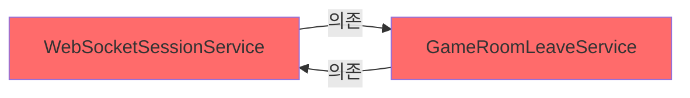
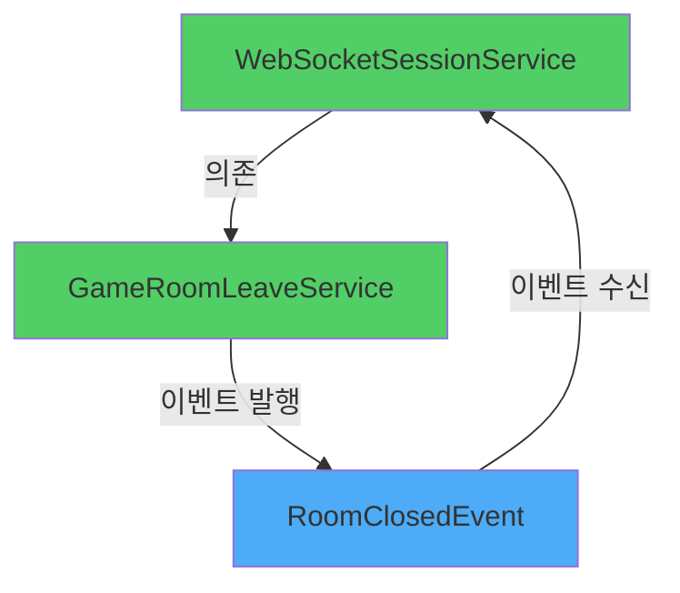

# Troubleshooting: WebSocket 서비스 간 순환 참조 해결

> **작성일**: 2025년 10월 23일  
> **문제**: `UnsatisfiedDependencyException` - 순환 참조로 인한 애플리케이션 실행 불가  
> **해결**: `@Lazy` 임시 대응 → Spring Events로 근본 해결

---

## 📌 목차
1. [문제 발견](#1-문제-발견)
2. [원인 분석](#2-원인-분석)
3. [1차 해결: @Lazy 적용](#3-1차-해결-lazy-적용)
4. [2차 해결: Spring Events 적용](#4-2차-해결-spring-events-적용)
5. [결과 비교](#5-결과-비교)
6. [배운 점](#6-배운-점)

---

## 1. 문제 발견

### 🚨 증상
애플리케이션 실행 시 다음과 같은 오류가 발생하며 서버가 구동되지 않음

### 📸 오류 로그 스크린샷


### 🔍 발생 시점
- 로컬 개발 환경에서 Spring Boot 애플리케이션 실행 직후
- Bean 생성 단계에서 의존성 주입 실패

---

## 2. 원인 분석

### 🔄 순환 참조 구조



### 📋 구체적인 호출 흐름

```java
// WebSocketSessionService.java
@Service
@RequiredArgsConstructor
public class WebSocketSessionService {
    private final GameRoomLeaveService leaveService;  // ← GameRoomLeaveService 의존
    
    private void handleRoomLeave(Long userId) {
        ParticipantEventResponse eventResp = leaveService.leaveCurrentRoomByUser(userId);
        // ...
    }
}
```

```java
// GameRoomLeaveService.java
@Service
@RequiredArgsConstructor
public class GameRoomLeaveService {
    private final WebSocketSessionService sessionService;  // ← WebSocketSessionService 의존
    
    private ParticipantEventResponse handleHostLeave(GameRoom room, ParticipantResponse hostResponse) {
        // ...
        sessionService.cleanupMultipleSessions(otherParticipantUserIds, roomId);  // ← 여기서 호출
        // ...
    }
}
```

### ⚡ 문제의 핵심
- **WebSocketSessionService**가 방 퇴장을 처리하기 위해 `GameRoomLeaveService`를 필요로 함
- **GameRoomLeaveService**가 방장 퇴장 시 세션 정리를 위해 `WebSocketSessionService`를 필요로 함
- Spring 컨테이너가 Bean 생성 시 어느 것을 먼저 만들어야 할지 결정할 수 없어 실패

---

## 3. 1차 해결: @Lazy 적용

### 💡 해결 전략
`@Lazy` 어노테이션을 사용하여 **의존성 주입 시점을 지연**시켜 순환 고리를 끊음

### 🔧 수정 코드

```java
// GameRoomLeaveService.java
@Service
@Slf4j
public class GameRoomLeaveService {
    
    private final GameParticipantRepository participantRepository;
    private final GameRoomRepository gameRoomRepository;
    private final WebSocketSessionService sessionService;  // @Lazy로 주입받음
    private final QuizStateCache quizStateCache;

    // @RequiredArgsConstructor 제거하고 명시적 생성자 작성
    public GameRoomLeaveService(
            GameParticipantRepository participantRepository,
            GameRoomRepository gameRoomRepository,
            @Lazy WebSocketSessionService sessionService,  // ← @Lazy 추가!
            QuizStateCache quizStateCache
    ) {
        this.participantRepository = participantRepository;
        this.gameRoomRepository = gameRoomRepository;
        this.sessionService = sessionService;
        this.quizStateCache = quizStateCache;
    }
    
    // ... 나머지 코드
}
```

### ✅ 결과
- ✔️ 애플리케이션 정상 실행
- ✔️ 기존 기능 정상 동작
- ⚠️ 하지만 **순환 참조 자체는 여전히 존재**

### ⚠️ 한계점
| 항목 | 상태 |
|------|------|
| 애플리케이션 실행 | ✅ 해결 |
| 순환 참조 근본 원인 | ❌ 미해결 |
| 코드 구조 개선 | ❌ 미개선 |
| 유지보수성 | ⚠️ 여전히 낮음 |

> **판단**: 급한 불은 껐지만, 기술 부채로 남아있어 리팩토링 필요

---

## 4. 2차 해결: Spring Events 적용

### 🎯 개선 전략
Spring의 **이벤트 기반 아키텍처**를 활용하여 순환 참조를 완전히 제거

### 📐 새로운 구조



### 🔨 구현 단계

#### Step 1: 이벤트 클래스 생성

```java
package app.signbell.backend.event;

import lombok.Getter;
import lombok.RequiredArgsConstructor;
import java.util.List;

/**
 * 방장 퇴장으로 방이 종료될 때 발행되는 이벤트
 */
@Getter
@RequiredArgsConstructor
public class RoomClosedEvent {
    private final Long roomId;
    private final List<Long> remainingUserIds;
}
```

#### Step 2: GameRoomLeaveService 수정

```java
@Service
@Slf4j
public class GameRoomLeaveService {

    private final GameParticipantRepository participantRepository;
    private final GameRoomRepository gameRoomRepository;
    private final QuizStateCache quizStateCache;
    private final ApplicationEventPublisher eventPublisher;  // ← 이벤트 발행자 추가

    public GameRoomLeaveService(
            GameParticipantRepository participantRepository,
            GameRoomRepository gameRoomRepository,
            QuizStateCache quizStateCache,
            ApplicationEventPublisher eventPublisher  // ← @Lazy 제거!
    ) {
        this.participantRepository = participantRepository;
        this.gameRoomRepository = gameRoomRepository;
        this.quizStateCache = quizStateCache;
        this.eventPublisher = eventPublisher;
    }

    private ParticipantEventResponse handleHostLeave(GameRoom room, ParticipantResponse hostResponse) {
        Long roomId = room.getId();
        log.info("방장 퇴장 감지 - 방 종료 처리 시작. roomId: {}", roomId);

        // 1. 참가자 조회 및 삭제
        List<Long> otherParticipantUserIds = participantRepository
                .findByGameRoom_Id(roomId)
                .stream()
                .filter(p -> !p.isHost())
                .map(p -> p.getParticipant().getId())
                .toList();

        int deletedCount = participantRepository.deleteAllByGameRoom(room);
        
        // 2. 방 종료 처리
        room.closeRoom();
        gameRoomRepository.save(room);

        // 3. 이벤트 발행 (기존: sessionService.cleanupMultipleSessions() 직접 호출)
        if (!otherParticipantUserIds.isEmpty()) {
            eventPublisher.publishEvent(new RoomClosedEvent(roomId, otherParticipantUserIds));
            log.info("방 종료 이벤트 발행 - roomId: {}, 대상 참가자: {}", roomId, otherParticipantUserIds.size());
        }

        log.info("방장 퇴장으로 방 종료 완료 - roomId: {}, 제거된 참가자 수: {}", roomId, deletedCount);

        return ParticipantEventResponse.builder()
                .eventType("ROOM_CLOSED")
                .participant(hostResponse)
                .currentParticipants(0)
                .gameRoomId(roomId)
                .roomClosed(true)
                .build();
    }
}
```

#### Step 3: WebSocketSessionService에 이벤트 리스너 추가

```java
@Service
@RequiredArgsConstructor
@Slf4j
public class WebSocketSessionService {

    private final GameRoomLeaveService leaveService;  // ← 기존 의존성 유지
    private final SimpMessagingTemplate messagingTemplate;
    private final UserSessionRegistry userSessionRegistry;

    // ... 기존 메서드들

    /**
     * 방 종료 이벤트 리스너
     * 
     * GameRoomLeaveService에서 방장이 퇴장해 방이 종료될 때,
     * 남은 참가자들의 세션을 정리합니다.
     * 
     * @param event 방 종료 이벤트
     */
    @EventListener
    public void handleRoomClosedEvent(RoomClosedEvent event) {
        log.info("방 종료 이벤트 수신 - roomId: {}, 대상 참가자 수: {}", 
                event.getRoomId(), event.getRemainingUserIds().size());
        
        cleanupMultipleSessions(event.getRemainingUserIds(), event.getRoomId());
    }

    // cleanupMultipleSessions 메서드는 그대로 유지
    public void cleanupMultipleSessions(List<Long> userIds, Long roomId) {
        // ... 기존 로직 유지
    }
}
```

### ✅ 테스트 결과

```bash
# 1. 애플리케이션 실행
./gradlew bootRun

# 2. 정상 실행 확인
✅ Started SignbellBackendApplication in 3.142 seconds

# 3. 방장 퇴장 시나리오 테스트
✅ 방 종료 이벤트 발행 성공
✅ 세션 정리 이벤트 수신 성공
✅ 모든 참가자 세션 정리 완료
```

---

## 5. 결과 비교

### 📊 해결 방법 비교표

| 구분 | 원본 (순환 참조) | 1차 해결 (@Lazy) | 2차 해결 (Events) |
|------|-----------------|-----------------|------------------|
| **실행 가능 여부** | ❌ 실행 불가 | ✅ 정상 실행 | ✅ 정상 실행 |
| **순환 참조 존재** | ❌ 존재 | ⚠️ 존재 (회피) | ✅ 제거 |
| **의존성 방향** | 양방향 | 양방향 | 단방향 |
| **결합도** | 높음 | 높음 | **낮음** |
| **테스트 용이성** | 어려움 | 어려움 | **쉬움** |
| **확장성** | 낮음 | 낮음 | **높음** |
| **유지보수성** | 낮음 | 중간 | **높음** |

### 🎯 개선 효과

#### Before (순환 참조)
```
WebSocketSessionService ⟷ GameRoomLeaveService
└─ 강한 결합
└─ 테스트 어려움
└─ 실행 불가
```

#### After (@Lazy)
```
WebSocketSessionService ⟷ GameRoomLeaveService (지연 초기화)
└─ 강한 결합 유지
└─ 테스트 여전히 어려움
└─ 실행 가능
```

#### After (Events)
```
WebSocketSessionService → GameRoomLeaveService
                              ↓
                         [RoomClosedEvent]
                              ↓
                   WebSocketSessionService (리스너)
└─ 느슨한 결합
└─ 테스트 용이
└─ 확장 가능
```

---

## 6. 배운 점

### 💭 기술적 인사이트

#### 1. **순환 참조는 설계 문제의 신호**
- 두 클래스가 서로를 직접 참조한다면, 책임 분리가 제대로 되지 않았을 가능성이 높음
- `@Lazy`는 증상 완화일 뿐, 근본 치료가 아님

#### 2. **이벤트 기반 아키텍처의 장점**
```java
// Before: 직접 호출 (강한 결합)
sessionService.cleanupMultipleSessions(userIds, roomId);

// After: 이벤트 발행 (느슨한 결합)
eventPublisher.publishEvent(new RoomClosedEvent(roomId, userIds));
```
- 발행자는 구독자를 알 필요가 없음
- 새로운 리스너 추가가 쉬움 (예: 로깅, 알림 등)

#### 3. **점진적 개선의 중요성**
1. **긴급 대응**: `@Lazy`로 빠르게 서비스 복구
2. **근본 해결**: 시간을 갖고 이벤트 기반으로 리팩토링
3. **기술 부채 관리**: 임시 해결책을 방치하지 않고 개선

### 🚀 적용 가능한 시나리오

이벤트 기반 아키텍처가 유용한 경우:
- ✅ 서비스 간 순환 참조가 발생할 때
- ✅ 한 작업 완료 후 여러 후속 작업이 필요할 때
- ✅ 비동기 처리가 필요할 때
- ✅ 기능 확장이 자주 일어날 때

### 📚 참고 자료

- [Spring Framework - Application Events](https://docs.spring.io/spring-framework/reference/core/beans/context-introduction.html#context-functionality-events)
- [Baeldung - Spring Events](https://www.baeldung.com/spring-events)
- [Circular Dependencies in Spring](https://www.baeldung.com/circular-dependencies-in-spring)

---

## 📝 관련 이슈 및 PR

- **Issue**: [#42 - WebSocket 관련 서비스 간 순환 참조로 인한 애플리케이션 실행 실패](issue-link)
- **PR (1차)**: [#42 - Bugfix: @Lazy를 사용한 순환 참조 임시 해결](pr-link-1)
- **PR (2차)**: [#XX - Refactor: Spring Events를 활용한 순환 참조 근본 해결](pr-link-2)

---

## ✨ 마무리

이번 트러블슈팅을 통해 **빠른 대응**과 **근본적인 해결** 사이의 균형을 맞추는 것이 중요하다는 것을 배웠습니다.

`@Lazy`는 긴급 상황에서 유용한 도구이지만, 이를 영구적인 해결책으로 두지 않고 **이벤트 기반 아키텍처**로 리팩토링함으로써 더 유지보수하기 좋은 코드를 만들 수 있었습니다.

앞으로도 비슷한 순환 참조 문제가 발생하면, 단순히 `@Lazy`로 회피하기보다는 **설계를 다시 검토**하는 습관을 가져야겠습니다.
