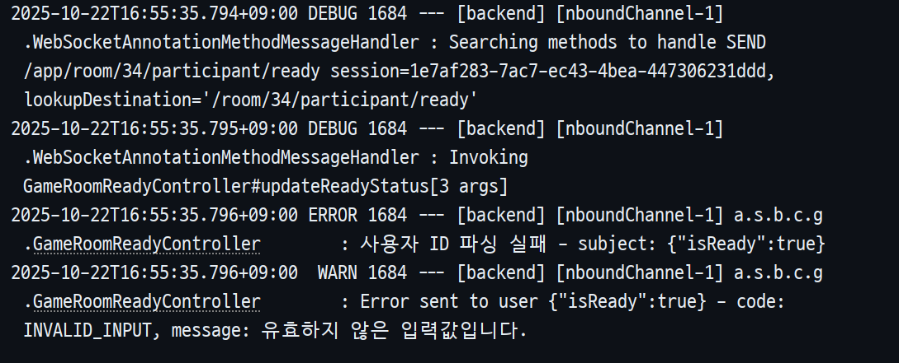

# 트러블 슈팅: WebSocket 환경에서 @AuthenticationPrincipal 주입 실패 원인 분석 (20251022)


# WebSocket 환경에서 @AuthenticationPrincipal 주입 실패 원인 분석

## 🧭 개요
WebSocket 기반 STOMP 통신 환경에서 `@AuthenticationPrincipal`이 `null`로 주입되는 문제를 분석하고,  
그 원인과 해결 방안을 정리한 문서입니다.

---

## 1. 문제 상황

`@MessageMapping` 기반의 WebSocket 컨트롤러에서  
다음과 같이 `@AuthenticationPrincipal`을 사용했을 때 인증 정보가 주입되지 않는 문제가 발생했습니다.

```java
@MessageMapping("/room/{roomId}/participant/ready")
public void updateReadyStatus(@DestinationVariable Long roomId,
                              @AuthenticationPrincipal CustomUserDetails user,
                              @Payload ReadyStatusRequest request) {
    // user == null
}
```



> 로그 상에서는 `user == null`로 확인되며,  
> JWT 인증이 정상적으로 이루어진 상태에서도 `Authentication` 객체가 비어 있는 현상이 발생했습니다.

---

## 2. 원인 분석

### 2.1 WebSocket의 인증 처리 흐름
- WebSocket 연결(`Handshake`) 시점에는 `CookieAuthHandshakeInterceptor`에서  
  쿠키에 담긴 JWT를 검증하고 `Principal` 객체를 세션에 등록합니다.
- 하지만 이후 실제 메시지(`SEND` → `@MessageMapping`) 처리는  
  **Spring Security의 필터 체인**을 거치지 않습니다.

### 2.2 `@AuthenticationPrincipal`의 작동 방식
`@AuthenticationPrincipal`은 내부적으로 `SecurityContextHolder`를 통해 인증 객체를 조회합니다.

```java
Authentication auth = SecurityContextHolder.getContext().getAuthentication();
return (auth != null) ? auth.getPrincipal() : null;
```

- 즉, `SecurityContext`에 `Authentication` 객체가 존재해야 합니다.
- 그러나 WebSocket 메시지 수신 시점에는 `SecurityContext`가 비어 있습니다.

### 2.3 결과적으로 발생한 문제
- `CookieAuthHandshakeInterceptor`는 `Principal`만 세션에 등록하고  
  `SecurityContextHolder`에는 인증 객체를 주입하지 않음.
- 따라서 `@AuthenticationPrincipal`이 참조할 인증 정보가 존재하지 않아 `null`이 주입됨.

---

## 3. 인증 흐름 비교

| 구분 | HTTP 요청 (REST API) | WebSocket 메시지 (STOMP) |
|------|------------------------|----------------------------|
| 인증 시점 | 매 요청마다 JWT 필터를 통해 수행 | 최초 Handshake 1회만 수행 |
| Principal 저장 위치 | `SecurityContextHolder` | `StompHeaderAccessor.getUser()` |
| `@AuthenticationPrincipal` | ✅ 정상 작동 | ❌ SecurityContext 없음 |
| `Principal principal` | ✅ 가능 | ✅ 가능 (세션 유지됨) |

---

## 4. 해결 방법

### ✅ 4.1 `Principal` 사용으로 변경 (권장)
WebSocket 메시지 컨트롤러에서는 `Principal`을 직접 주입받아 사용하는 것이 가장 안정적입니다.

```java
@MessageMapping("/room/{roomId}/participant/ready")
public void updateReadyStatus(@DestinationVariable Long roomId,
                              Principal principal,
                              @Payload ReadyStatusRequest request) {
    Long userId = Long.valueOf(principal.getName());
    readyService.updateReadyStatus(roomId, userId, request.isReady());
}
```

- STOMP 내부적으로 `Principal`은 핸드셰이크 시 설정된 사용자 정보를 유지합니다.
- 즉, `CookieAuthHandshakeInterceptor`에서 주입한 값이 그대로 전달됩니다.

### ⚙️ 4.2 `@AuthenticationPrincipal`을 유지하고 싶은 경우 (비권장)
`ChannelInterceptor`를 통해 메시지 수신 시마다  
`SecurityContextHolder`에 인증 객체를 수동으로 세팅할 수 있습니다.

```java
@Override
public Message<?> preSend(Message<?> message, MessageChannel channel) {
    StompHeaderAccessor accessor = MessageHeaderAccessor.getAccessor(message, StompHeaderAccessor.class);
    if (accessor != null && accessor.getUser() != null) {
        SecurityContext context = SecurityContextHolder.createEmptyContext();
        context.setAuthentication(new UsernamePasswordAuthenticationToken(accessor.getUser(), null, List.of()));
        SecurityContextHolder.setContext(context);
    }
    return message;
}
```

> 하지만 이 방식은 유지보수가 어렵고,  
> 스레드 간 컨텍스트 전파 이슈가 발생할 수 있어 실시간 서비스에는 비추천입니다.

---

## 5. 결론

- `@AuthenticationPrincipal`은 Spring Security의 HTTP 필터 체인을 전제로 작동합니다.
- WebSocket에서는 이 체인을 거치지 않으므로,  
  `Principal`을 사용하여 인증된 사용자 정보를 가져오는 것이 가장 안정적입니다.
- 즉, WebSocket에서는 `principal.getName()`이 인증된 사용자 ID 역할을 하게 됩니다.

---

## 6. 핵심 정리

| 항목 | 권장 여부 | 설명 |
|------|------------|------|
| `Principal principal` 사용 | ✅ 권장 | WebSocket 기본 지원, 안정적 |
| `@AuthenticationPrincipal` 사용 | ⚠️ 비권장 | SecurityContextHolder 미전파 |
| Handshake 인증 (`CookieAuthHandshakeInterceptor`) | ✅ 유지 | Principal 세션 등록을 담당 |
| SecurityContext 전파 커스터마이징 | ⚙️ 가능 | Interceptor에서 수동 세팅 필요 |

---

## 참고 파일
- `CookieAuthHandshakeInterceptor.java`
- `WebSocketSecurityConfig.java`
- `GameRoomReadyController.java`
- `SingleSessionChannelInterceptor.java`

---

## 요약 문장
> WebSocket 컨트롤러에서 `@AuthenticationPrincipal`이 동작하지 않은 이유는  
> STOMP 메시지 처리 시 Spring Security의 필터 체인이 적용되지 않아  
> `SecurityContextHolder`가 비어 있었기 때문이다.  
> 따라서 WebSocket 환경에서는 `Principal` 인자를 통해 사용자 인증 정보를 직접 참조하는 것이 권장된다.
